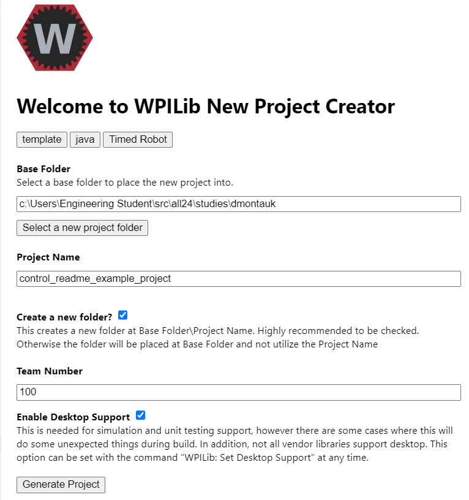

# Your First 'Study'
The `serve100` code you were deploying to the RoboRIO is the "competition setup", which includes a ton of complex setup code (to map all of the motors, devices, etc) and control code. Your RoboRIO should have been complaining that it couldn't find any of the devices requested on the CAN bus since... you don't have them. We *could* try to hack all of that code but... that would take forever. 

Instead, let's start a *completely* new project. We call these 'studies'. This will teach you about the simplest way to control a robot and we'll build on it over time to get to the 'competition level' robots.

## Create a New Study
WPILib comes with a wizard to start a new project. 

1. Click on the "WPILib" icon and type "New Project".
    1. 
1. Create a folder with your Github username under the `all24/studies` folder. This will make it easier to track which belong to you.
1. In the New Project wizard, make sure you select `Template > Java > Timed Robot`. Then choose a clever name for your project and make sure `Desktop Support` is checked. 
    1. 
1. When it asks what you want to do with the folder, tell it to open in a New Window.


## Make Sure Build + Deploy Work
Let's make sure the WPILib plugin can build your Study and deploy it to the RoboRIO. Follow the previous instructions (remember those?) on how to build + deploy, but select your Study instead of `swerve100` this time.

If your deploy is successful, you should see in the Driver Station that Communications is GREEN, Robot Code is GREEN, and there are no errors scrolling in the log:


## Send a Pull Request With Your Study
Time to send your code in for review. If you are not familiar with Git, go read our [Git beginner guide](TODO!!).

1. In a Terminal, go to your Study directory.
1. Create a new branch.
1. `git add` all your code.
1. `git push` your branch to Github.
1. Click on the link to create a new PR. 

## Get the 'lib' Directory Included
Starting from scratch is daunting! Fortunately, you can reuse most of the Team100 code because the common functionality for motor control, etc etc, is all in the `lib` directory. We need to instruct Gradle how to include this code in the build. 

There are 3 steps to make this work:

### Create a New Workspace for your Study 
VSCode just opened your single folder, but you actually need the `lib` folder opened as well to make working easier. Fortunately, VSCode supports the concept of a `workspace` which keeps track of various folders and settings it needs to open together.

To make a workspace file, in your project in vscode, click "add folder to workspace" choosing the lib folder, and then "save workspace to file," choosing your project directory as the location to save it.

This should result in a file at the root level of your project (next to build.gradle) that looks like this:

```json
{
  "folders": [
    {
      "path": "."
    },
    {
      "path": "../../lib" // <-- this might look different depending how deep you put your folder
    }
  ],
    "settings": {
      "java.configuration.updateBuildConfiguration": "automatic",
      "java.server.launchMode": "Standard"
    }
}
```

### Edit build.gradle to include lib code
In your build.gradle file, add this clause just after the "plugins" clause (near the top).

```gradle
sourceSets {
    main {
        java {
            srcDir "../../lib/src/main/java" // <-- this might look different
        }
    }
}
```

You also need to add some dependencies.  So inside the "dependencies" section, add these:

```gradle
    implementation 'org.msgpack:jackson-dataformat-msgpack:0.9.3'
    implementation "org.ejml:ejml-simple:0.43.1"
```

### Copy the `lib` vendordeps to your project
To copy the vendordeps files, find the vendordeps directory in lib, highlight one, say, "NavX.json", and click "copy."

Then find the vendordeps directory in your project (it should contain WPILibNewCommands.json and nothing else).

Highlight the directory name ("vendordeps") and click "paste."

Repeat this process for each of the other two vendordeps files.

## Try to Build Again
Always good to make sure everything works :) Run another Build + Deploy and make sure there aren't any errors.