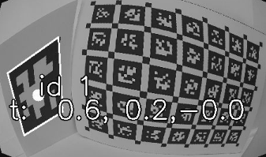

# Distortion

The tag detector looks for high-contrast quadrilaterals as candidate tags, looking for the solid black frame around the tag.

Our detection pipeline does not undistort the image prior to detection, because undistorting all the pixels is slow.  Instead, we undistort the corner points of the detected tag.

But because the detector looks for *straight* lines, this approach limits the distortion that we can handle.  The highest level of allowed distortion looks something like this:

For comparison, here's the original:

So this is obviously a whole lot of distortion, so maybe not an issue.  But if the detector seems to fail for close-up tags, maybe this is the reason.